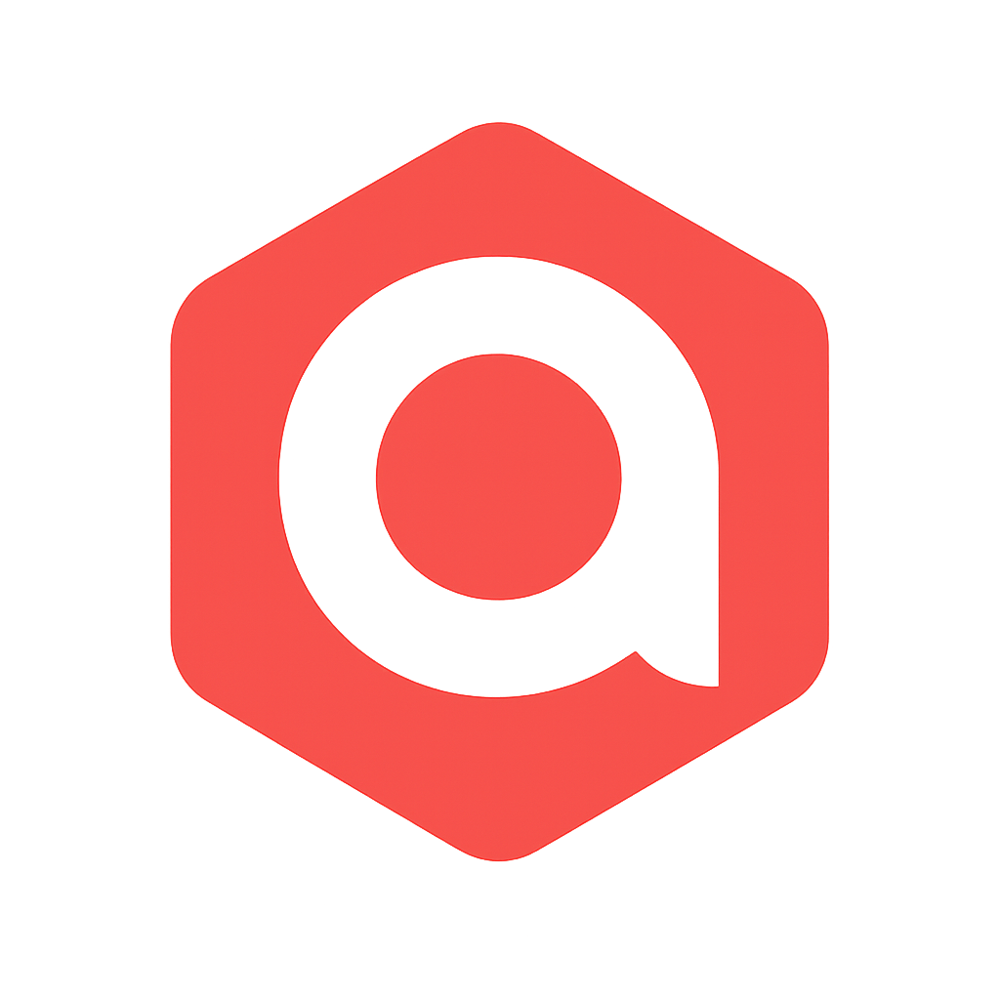

# Asset Anchor

Asset Anchor is a full-stack SaaS property management platform that connects landlords and tenants. The platform streamlines rent collection, maintenance requests, document management, and communications between all parties.

## Features

### Backend (Flask + SQLAlchemy)
- Role-based authentication (landlord, tenant, admin)
- Stripe Connect integration for payment processing
- Email verification and password reset flows
- Real-time messaging via Socket.IO
- Maintenance request tracking with status updates
- Document upload and management
- Notifications system with unread/read state
- RESTful API with JWT-secured endpoints
- Webhook support for Stripe events
- Flask-Migrate and Alembic for database migrations
- Production-ready config (HTTPS headers, Talisman, logging)
- Monitoring with Prometheus and Grafana
- Comprehensive test suite
- Rate limiting protection for API endpoints
- Production-hardened security headers

### Frontend (React + Material UI)
- Responsive design for desktop and mobile
- Role-specific dashboards and interfaces
- Real-time updates with Socket.IO
- Stripe Elements integration for payments
- Document viewing and uploading
- Interactive charts for analytics
- Form validation and error handling
- Optimized build for production deployment
- Landlord and tenant onboarding flows
- Admin dashboard with user/property management
- Real-time chat UI per property
- Notifications dropdown with unread badge
- Fully responsive layout (mobile/tablet/desktop)
- Form validation and error handling
- Dashboard analytics and navigation
- Stripe payment UI integration
- Error boundaries for improved reliability
- Standardized error handling and notifications

## Tech Stack

- **Frontend:** React, Material UI, Socket.IO-client, Axios
- **Backend:** Flask, SQLAlchemy, Flask-JWT-Extended, Flask-SocketIO, Stripe SDK
- **Database:** PostgreSQL (production) or SQLite (local development)
- **Deployment:** Docker, Render (backend), Vercel (frontend)

## Production Hardening

The application has been hardened for production with the following enhancements:

### Backend Security
- Health check endpoint for containerization and monitoring
- Consolidated Stripe webhook handling with signature validation and idempotency
- Config consolidation for easier maintenance
- Rate limiting on sensitive endpoints
- Enhanced Content Security Policy (CSP)
- Secure cookie settings and HTTPS enforcement
- Standardized error response format

### Frontend Reliability
- Error boundary implementation for graceful error handling
- Standardized API error handling utilities
- Toast notification system for user feedback
- Authentication token refresh mechanism
- Improved API error logging

## Setup Instructions
