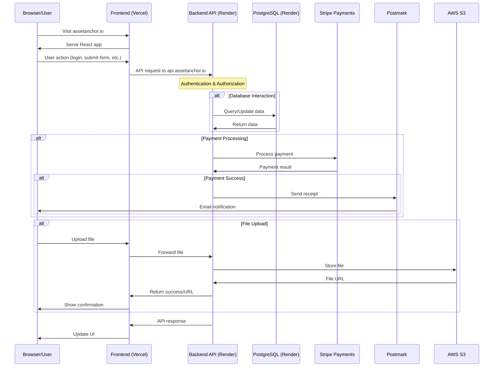

# Asset Anchor Architecture

This document describes the production architecture for Asset Anchor.

## Overview

Asset Anchor is a property management SaaS application that connects landlords, tenants, and property managers. The application consists of a React frontend and a Flask API backend.

## Architecture Components

### Infrastructure

| Component | Provider | Purpose |
|-----------|----------|---------|
| Frontend Hosting | Vercel | Hosts the React frontend application |
| Backend Hosting | Render | Hosts the Flask API application |
| Database | Render PostgreSQL | Stores application data |
| Email Service | Postmark | Sends transactional emails |
| File Storage | AWS S3 | Stores user-uploaded files |
| Payments | Stripe | Processes payments and subscriptions |
| Domain & DNS | DNS Provider | Routes traffic to Vercel and Render |
| SSL | Let's Encrypt (via Vercel/Render) | Secures communications |

### Domain Structure

- `assetanchor.io` - Main application (Vercel)
- `www.assetanchor.io` - Redirects to main domain (Vercel)
- `api.assetanchor.io` - API endpoints (Render)

## Architecture Diagram

## Component Details

### Frontend (Vercel)
- React application built with Create React App
- Communicates with backend via REST API
- Handles UI rendering and client-side validation
- Implements authentication flow with JWT

### Backend API (Render)
- Flask application with RESTful endpoints
- Implements business logic and data validation
- Manages database interactions via SQLAlchemy
- Authenticates requests via Flask-JWT-Extended
- Processes webhooks from third-party services

### Database (Render PostgreSQL)
- Stores all application data
- Managed PostgreSQL instance
- Migrations managed via Flask-Migrate/Alembic

### Stripe Integration
- Processes payments and subscriptions
- Webhooks notify backend of payment events
- Frontend uses Stripe Elements for secure payment forms

### Email (Postmark)
- Sends transactional emails (welcome, receipts, notifications)
- Handles email deliverability and tracking
- Templates managed in the backend

### File Storage (AWS S3)
- Stores user-uploaded files (property images, documents)
- Securely accessed via presigned URLs
- Organized in buckets by tenant

## Security Measures

- All communications secured via HTTPS/TLS
- API protected by JWT authentication
- CORS restrictions to prevent unauthorized API access
- CSP headers to prevent XSS attacks
- Rate limiting to prevent abuse
- Input validation on all endpoints
- Database access via parameterized queries
- Regular security audits and dependency updates
